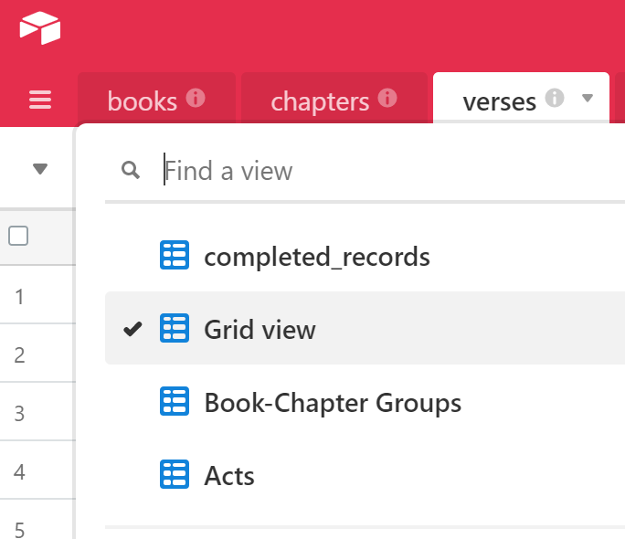
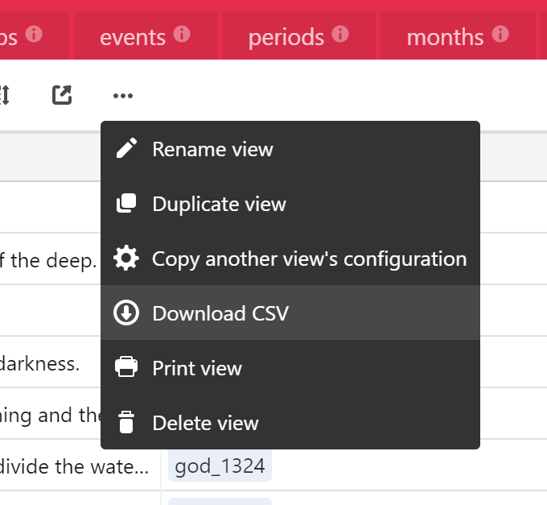
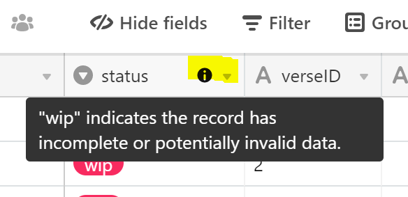

# View and Export Data with Airtable

Airtable offers a no-code, spreadsheet-like interface to search, filter, and inspect all data in Theographic. See the instructions below to choose a pre-defined view and download as a CSV.

👉 [**Access the Aitable data here**](https://airtable.com/shrlkhIzIUzmx9whR)

---

## Intro to Airtable

Get a brief tour of Airtable [here](https://airtable.com/product) watch the in-depth tutorial below.

[https://vimeo.com/263305987](https://vimeo.com/263305987)

## Choosing pre-defined views

n some tabs, there are pre-defined views that let you choose a subset of the data to view or download. These views will identify records which are fully validated (completed_records) or provide quick access to grouped and pre-filtered sets. Click the drop-down at the top-left to change views.

## Downloading as a CSV file

Data sets are separated by tabs which can be downlaoded separately. From each tab, choose the `...` menu and click **Download CSV**.

## Field-specific comments

Column headers with an "i" symbol contain explanatory details. Hover on this icon to view comments.

